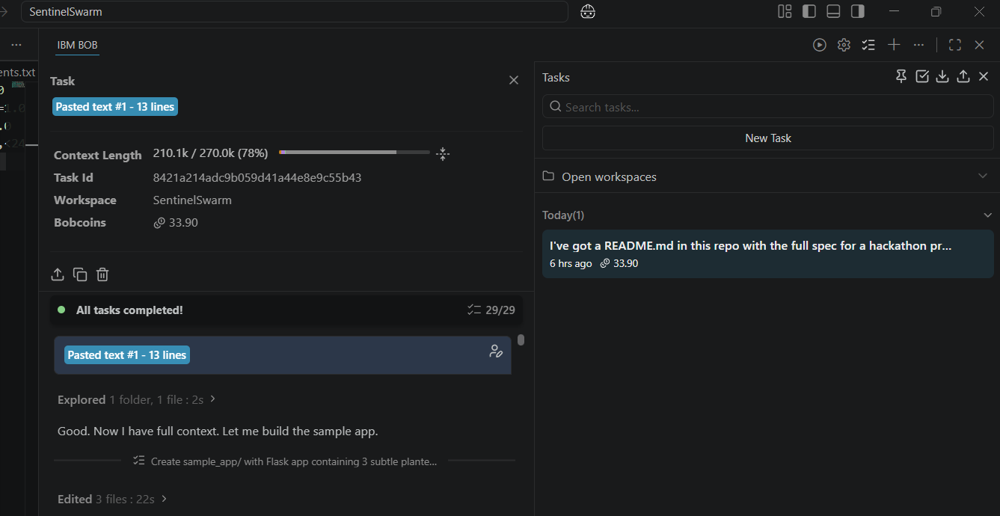

# Sentinel Swarm

**Your codebase has bugs nobody has reported yet. We send four AI agents to find them, break them open, fix them, and hand you the receipts — in about ninety seconds.**

Built for the **IBM Bob 2.0 Hackathon** (lablab.ai, September 2026).

> **Live demo:** `<your-render-url-here>` · **Demo video:** `<link>` · **Stack:** Python 3.12 · Flask · pytest · Docker · IBM Bob 2.0

---

## 1. What this actually is

Most AI coding tools wait for a human to notice a problem and describe it. Then the AI fixes what was described.

Sentinel Swarm doesn't wait for the ticket. You point it at a codebase. Four specialized Bob 2.0 subagents go in with no bug report, no hints, and no instructions about what's wrong — and they come back with a bug that is **proven to exist**, a fix that is **proven to work**, and a written report. You watch the whole thing happen in the browser.

Click one button. That's the entire interface.

---

## 2. The idea in one sentence

**A bug is only reported if a test was written, actually executed against the real code, and actually failed.**

No observation is reported unless it produced a red test that then went green after a fix. Everything else is discarded silently.

This is the whole design. It exists because AI code review has a credibility problem: an LLM saying "this might have an off-by-one error" costs nothing to produce and is often wrong. Sentinel Swarm refuses to make claims it cannot demonstrate.

If the generated test doesn't compile, or compiles but passes, **the finding is thrown away**. The system would rather report *nothing* than report a guess. That's the anti-hallucination guarantee, and it's structural — not a prompt instruction the model could ignore.

---

## 3. How it works

Four Bob 2.0 calls, in sequence. Each one is a real API call with a narrowly scoped prompt — none of the "thinking" is hardcoded.

| Agent | What it does | What you see |
|---|---|---|
| **Scout** | Reads the target source and maps what each function does and where inputs come from | Panel lights up with a summary of the attack surface |
| **Saboteur** | Picks the single most bug-prone function and writes a real pytest test targeting an edge case (None, empty input, wrong type, boundary value) | The generated test code, and pytest's verdict |
| **Medic** | Given the failing test and the broken function, writes a patch. The patch is applied and **the exact same test is re-run** | The diff, and the second pytest verdict |
| **Scribe** | Turns the whole run into a human-readable case file with a severity score | The case-file card, with Fragility Score and Proof Badge |

### The proof chain

```
Scout    → maps the code                 (no claim yet)
Saboteur → writes a test, pytest runs it → TEST FAILS   ← bug is now proven, not claimed
Medic    → patches the code, pytest runs the SAME test → TEST PASSES ← fix is now proven
Scribe   → writes it up                  (reporting only what was demonstrated)
```

The middle two steps are the ones that matter. `pytest` is the only component in the entire system that is allowed to declare something true. Bob proposes; pytest decides.

### What the case file contains

`title` · `function_name` · `explanation` · `severity_score` (the "Fragility Score", 1–10 — how easily a real user would hit this)

---

## 4. Try it

**Hosted:** `<your-render-url-here>` — no install, no login, nothing to configure.

**Locally:**

```bash
git clone <repo-url> && cd SentinelSwarm
python -m venv .venv && source .venv/bin/activate
pip install -r orchestrator/requirements.txt

# Bob Shell CLI (Node 22+ required)
curl -fsSL https://bob.ibm.com/download/bobshell.sh | bash -s -- --pm npm

cd orchestrator
echo "BOBSHELL_API_KEY=your_key_here" > .env
flask --app app run --port 5001
```

Open `http://localhost:5001`, pick a target, click **Release the Swarm**.

> **This costs real API credits.** One run = four Bob calls. The dev-only smoke routes (`/test-scout`, `/test-saboteur`, `/test-medic`) are **off by default** and require `SENTINEL_DEV_ROUTES=1`, because they are unauthenticated and each one spends credits.

---

## 5. What it hunts: three seeded targets

The demo ships three small Flask apps, each with two deliberately planted bugs. These exist so the demo is **reliable and reproducible** — you never gamble on whether the model will find something during a live recording.

| Scenario | Bug 1 | Bug 2 |
|---|---|---|
| **User API** | URL params arrive as strings, but the user store is keyed by ints — `"1"` never matches `1`, so lookups silently return nothing | `age` is compared numerically before the `None` check, so a missing `age` raises `TypeError` |
| **Pagination** | `end = start + page_size + 1` — every page returns one item too many | A missing `?q=` query param yields `None`, then `None.lower()` raises `AttributeError` |
| **Payments** | `amount * (1 - discount_percent)` treats `10` as a fraction instead of 10% — a $100 charge becomes **−$900** | `float(amount)` runs on the first line, *before* the `amount is None` guard below it, so bad input raises instead of returning a clean validation error |

Every one of these is a realistic bug: each is a small ordering or units mistake that looks correct on a quick read. The full answer key lives in `scenarios/*/PLANTED_BUGS.md` and is gitignored.

---

## 6. Bring your own code

The **Paste Your Code** tab accepts arbitrary Python and runs the same four-agent pipeline against it.

Anything pasted goes through a safety filter first (`orchestrator/sandbox_runner.py`):

1. **Static AST analysis** — the code is parsed and walked before anything runs. Blocked imports (subprocess, socket, os, ctypes, pickle, importlib…), blocked calls (`eval`, `exec`, `compile`, `__import__`, `getattr`…), and blocked attributes (`__globals__`, `__subclasses__`, `__reduce__`, frame objects…).
2. **Resource-capped probe** — if it passes the static screen, it runs in a subprocess with `RLIMIT_CPU` and `RLIMIT_AS` set, and a hard timeout.
3. Only then does the pipeline run against it, in a temp directory that is deleted afterwards.

**Be clear-eyed about this:** an AST blocklist is a *heuristic, not a proof*. It raises the cost of the obvious attacks; it is not a security boundary, and we do not claim it is. See the challenges section — we found ten working bypasses in our own filter and closed them, and we'd expect a determined attacker to find more.

---

## 7. Security and safety decisions

| Decision | Why |
|---|---|
| `/run-swarm` is **POST-only** | It rewrites files on disk and spends four API calls. As a GET it could be triggered by a link prefetch, a crawler, or address-bar autocomplete against the public URL |
| Dev smoke routes **gated behind an env var** | They're unauthenticated and each spends real credits. Anyone who guessed the path could drain the account |
| Scenario paths come from an **allow-list** | The client sends a scenario *id*, never a path. There is no path-traversal surface |
| Dev routes return **JSON errors, never HTML tracebacks** | The frontend does `await res.json()`. An HTML error page surfaces in the browser as a confusing parse error instead of the real cause |
| `.env` is **gitignored *and* dockerignored** | `COPY . .` in Docker does not read `.gitignore`. Without an explicit `.dockerignore` the API key would be baked into an image layer, where it survives deletion in later layers |
| The Medic **restores the original file on every failure path** — including Ctrl-C and SIGKILL | A half-written or unverified patch must never be left on disk |

---

## 8. Challenges we actually hit

These are the real ones. Several of them cost hours, and two of them would have failed *silently* in front of judges.

### 8.1 The installer that hung forever

Render's build hung in an infinite loop printing:

```
✗ Invalid selection. Please enter a number between 1 and 3.
bash: line 187: /dev/tty: No such device or address
```

**Root cause:** Bob's installer prompts for a package manager (npm / pnpm / yarn) whenever more than one is present. It reads from `/dev/tty` *explicitly*, inside a `while true` loop with no exit path. Render's build container has no controlling terminal, so the read fails instantly, the choice stays empty, it fails validation, prints the error, and spins — forever.

**Why the obvious fixes fail:** `echo "1" | bash` doesn't work, and neither does `< /dev/null` — the script's own `< /dev/tty` redirect overrides any stdin you give it. There is no environment variable it checks first; we read all 369 lines to confirm.

**The fix:** the installer supports `--pm`, but `curl | bash` can't pass arguments to the script. You have to hand them to the piped interpreter:

```bash
curl -fsSL https://bob.ibm.com/download/bobshell.sh | bash -s -- --pm npm
```

We reproduced the hang locally (**4,144 error messages in 4 seconds**) and confirmed the flag drops it to zero.

### 8.2 Our sandbox didn't sandbox

We wrote an AST blocklist to screen untrusted pasted code, then attacked our own filter.

**We found ten working bypasses.** Among them: `getattr` chains that reached dunder attributes the blocklist named but never checked, `__reduce__`-based deserialization gadgets, frame-object access to reach the caller's globals, and — most embarrassingly — blocked attribute *names* sitting in plain string literals, which the original visitor never inspected.

**The fix:** blocklist grew from ~15 modules to ~40, plus new `visit_Name` and `visit_Constant` visitors that catch attribute access disguised as strings.

**What it taught us:** a blocklist is a heuristic, not a proof. That's now written into the module's own docstring, so nobody who reads the file later mistakes it for a security boundary.

### 8.3 Proving the pipeline works when you can't afford to run it

We had very few Bob credits left and could not spend them testing our own error handling. But an untested error path in a live demo is a liability.

**The approach:** we stubbed the four Bob-calling functions and drove the real Flask routes through a test client — exercising every verdict branch (`no_bug_found`, `fix_failed`, `fix_confirmed`, collection errors, and unexpected exceptions) with **zero API calls**. We also proved the one function that actually talks to Bob was byte-identical to its pre-refactor version using an AST comparison, rather than trusting a visual diff.

**Why it matters:** being unable to afford the API is not a reason to ship unverified code. It's a reason to build a better harness.

### 8.4 "Test failed" vs "test couldn't run"

Early on, a pytest *collection error* — a syntax error or bad import in Bob's generated test — was being treated the same as a genuine test failure. That meant a typo in generated code could be reported as a **proven bug**.

**The fix:** a distinct `collection_error` outcome. If pytest can't even collect the test, that's an environment problem, and the run reports it as such instead of claiming a finding. A hung test run is handled the same way.

This one matters because it goes straight to the credibility of the entire premise. A system whose selling point is "we only report proven bugs" cannot afford to mistake a broken test for a real finding.

### 8.5 Four deployment failures in a row

Getting this onto Render was a gauntlet, and each fix revealed the next:

1. **Render's own buildpack failed** — `render-build-tool: command not found` inside their `common.sh`, before any of our build steps ran. Not our code.
2. **The installer hang** (§8.1).
3. **`npm error enoent: mkdir '/usr/local/lib/node_modules'`** — npm creates the leaf package directory but not its parent, and `/usr/local` isn't writable by Render's build user. Fixed by pointing `NPM_CONFIG_PREFIX` at a project-owned directory and creating it explicitly first.
4. **`tput: command not found`** — something in the install chain calls `tput` for terminal colors. Slim containers ship no terminfo tools, and under `set -e` the missing binary aborted the entire build. Fixed with a no-op `tput` stub placed at the front of `PATH`, installed image-wide so it covers the runtime container too — not just the build.

We moved to a **Dockerfile** to remove the buildpack from the path entirely.

### 8.6 The bug we caught before it bit us

While writing the Docker `CMD`, we noticed gunicorn defaults to binding `127.0.0.1:8000`. On Render, the proxy is outside the container — so the deploy would have gone **green** and the URL would have been **dead**. Every log healthy, nothing reachable.

The fix is one flag (`--bind 0.0.0.0:$PORT`), but the failure mode is the dangerous kind: it looks like success. We also pinned `--workers 1`, because the pipeline rewrites files on disk (Medic patches the scenario, Saboteur writes the test file) and concurrent workers would race on them.

---

## 9. Tech stack

| Layer | Choice | Why |
|---|---|---|
| Orchestration | Python 3.12 + Flask | Simple to reason about; the pipeline is inherently sequential |
| AI reasoning | **IBM Bob 2.0** (Bob Shell CLI, `--format json`) | Every decision in all four stages is a real Bob call |
| Test execution | `pytest` subprocess | The only source of truth in the system |
| Frontend | Plain HTML / CSS / JS | No build step, no framework — the whole UI is one file |
| Serving | gunicorn | 1 worker, because the pipeline mutates files on disk |
| Packaging | Docker | The native buildpack was failing in its own tooling |

**Notably absent:** no database, no auth, no user accounts, no state between runs. Every run starts by restoring the scenario from its `.bak` file, so the demo is idempotent — you can run it a hundred times and get the same result.

---

## 10. Repo layout

```
Dockerfile                  Render deployment (Docker, not buildpack)
.dockerignore               keeps .env and the answer key out of the image
render-build.sh             previous buildpack build script (kept for reference)
orchestrator/
  app.py                    routes + pipeline orchestration
  scout.py  saboteur.py     the four subagents — one Bob call each
  medic.py  scribe.py
  bob_client.py             the ONLY file that talks to Bob (subprocess + JSON parsing)
  sandbox_runner.py         AST screen + resource-capped probe for pasted code
  templates/index.html      the entire frontend, single file
scenarios/                  three demo targets, each with app.py + app.py.bak
  user_api/  pagination/  payments/
```

---

## 11. What we deliberately did not build

Scoping is a design decision, and these were choices — not oversights.

- **No multi-bug runs.** One run finds and fixes one bug. Finding several is a nice-to-have; making one bulletproof is the demo.
- **No live streaming to the browser.** The four panels reveal in sequence *after* the pipeline returns, rather than streaming as each step completes. The work itself is real and sequential — but it's a single POST, and the UI replays the sequence when it lands. A WebSocket (or SSE) upgrade is the obvious next step and would make the visualization literally live. We're calling this out rather than letting it look like something it isn't.
- **No writes back to a real repository.** The fix is shown as a diff and applied to a local file. Nothing is ever pushed. Blast radius: zero.
- **No arbitrary GitHub repo URLs.** You can paste code, but there's no "point it at any repo" feature — that's a large surface area and it isn't what the demo is proving.

---

## 12. How IBM Bob 2.0 is used

Bob is not a wrapper around this project — it *is* the reasoning at every stage. Four distinct calls per run, each with a scoped prompt and each returning data the next stage depends on:

1. **Scout** — reads the source, produces a function-level summary. Its output is the input to Saboteur, so a bad summary changes what gets tested.
2. **Saboteur** — given that summary, chooses which function to attack and writes the actual pytest test. Bob writes the code that decides whether a bug exists.
3. **Medic** — given the failing test and the original function, produces the patch. Bob writes the fix.
4. **Scribe** — turns the run's evidence into a case file with a severity score.

**What we'd highlight:** no part of the "finding a bug" logic is hardcoded. The three scenarios have known bugs, but the system is never told what they are or where to look. It finds them by reading the code. If Bob couldn't reason about the code, the demo would produce nothing.

The only deterministic code in the loop is pytest — deliberately. We wanted the *judgement* to be probabilistic and the *verdict* to be mechanical.

### Proof of use



Sentinel Swarm was itself built inside IBM Bob 2.0 — the screenshot above is the project workspace, 29 of 29 tasks completed. We used Bob to write the orchestration layer, the sandbox filter, and the frontend, then pointed the finished pipeline back at Bob as its reasoning engine. Bob is both the tool we built with and the thing that makes the demo work.

---

## 13. Known limitations

We'd rather tell you than have you find them.

- **One bug per run**, and the Saboteur writes one test per run. If it picks a function whose test happens to pass, the run reports "no bug found" rather than retrying with a different target.
- **The sandbox is a heuristic** (§8.2). Treat pasted code as untrusted and don't run this somewhere that matters.
- **The visualization is a replay, not a live feed** (§11).
- **Scenario state is not persistent.** Medic patches files in the container, so a container restart resets the targets. For this demo that's a feature — runs are repeatable — but it wouldn't suit real use.
- **`bob --accept-license` runs at image build time.** If it ever fails silently, the first real run surfaces it rather than the build.

---

## 14. Team

`<names>` · built in 48 hours for the IBM Bob 2.0 Hackathon.

*"We don't suggest bugs. We prove them."*
